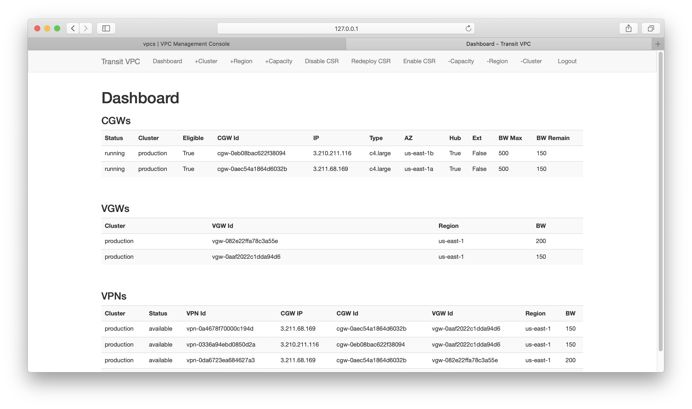

# AWS Stand Alone Cloud Transit VPC Web Interface
## Description
Summary: This program automates the lifecycle of Cisco CSR1000v routers for use with the stand-alone transit VPC 
solution.

IT operations must ensure enterprise IT policies are followed. These include:
* Security
* Routing
* QoS

Application owners and developers desire rapid on-demand provisioning of their applications.

This program enables IT operations to rapidly provision a scalable and secure IPSEC overlay network for interVPC cloud routing.

## Installation - Docker
1. Clone the repository from GitHub
    - ````````git clone https://github.com/stmosher/AWS_Stand_Alone_Transit_VPC_Web.git````````
2. Edit set_env_vars_empty.sh with your appropriate DMVPN, AWS, and Web App access credentials. See example below:
    - ````````#!/usr/bin/env bash ````````
    - ````````export SECRET_KEY='key123'````````
    - ````````export FLASK_APP=web_app.py````````
    - ````````export dmvpn_password='HardPasswordToGuess'````````
    - ````````export AWS_ACCESS_KEY_ID='1111111111111'````````
    - ````````export AWS_SECRET_ACCESS_KEY='123451234512345'````````
    - ````````export export web_username='Administrator'````````
    - ````````export web_password='Password123'````````
3. Run script to set environment variables:
    - ````````source ./set_env_vars_empty.sh````````
4. Edit config.py file:
    - Add regions
        - Note dedicate instance of program to either commercial or GovCloud regions as access credentials are different
        - Per region:
            - configure CSR1000v AMI id
            - configure AWS key name
            - set eligible_default to 'True' or 'False'
                - 'True' sets router eligible for VPNs after deployment. -Good for hourly AMI
                - 'False' sets router ineligible for VPNs after deployment. -Allows you to configure licensing and then 
                set router to eligible
            - set smart_licensing to 'True' or 'False'
                - 'True' automates the smart licensing configuration and registration
                - 'False' does not configure smart licensing
            - configure instance types for region
                - allows program to verify instance types are offered in region    
    - Optional Add Smart Licensing Info
        - All feature sets must be the same
        - If multiple licenses with differing throughputs are listed, program picks the best license throughout for instance size's IPSEC performance    
        - Licensing
            - Add dictionary to list consisting of 
                 - license_token - Appropriate smart licensing token
                 - license_feature_set - Appropriate feature set in your account
                 - license_throughput - Appropriate throughput of licenses
        - dns_server
        - email_address
        - smart_licensing_server, i.e. 'https://tools.cisco.com/its/service/oddce/services/DDCEService' or your appropriate satellite server address
        
5. Copy your applicable AWS keys to directory "keys"
6. Build docker container
    - ````````docker build -f Dockerfile_web_app -t web_app:latest .````````
6. Run docker container
    - ````````docker run --name web_app -d -p 8000:5000 --rm -e AWS_ACCESS_KEY_ID=$AWS_ACCESS_KEY_ID -e AWS_SECRET_ACCESS_KEY=$AWS_SECRET_ACCESS_KEY -e SECRET_KEY=$SECRET_KEY -e dmvpn_password=$dmvpn_password -e web_username=$web_username -e web_password=$web_password web_app:latest````````
7. Use browser to access web-server on port specified in docker run command, e.g., 127.0.0.1:8000
8. Log into web-server using previously set web_username and web_password environment variables
9. Install and run the TVPC Poller app found at https://wwwin-github.cisco.com/stmosher/GovCloud_Poller_Program.git
## Installation - Local
1. Clone the repository from GitHub
    - ````````git clone https://github.com/stmosher/AWS_Stand_Alone_Transit_VPC_Web.git````````
2. Create a virtual environment
    - `````` python3 venv venv ``````
3. Activate virtual environment
    - ```````` source venv/bin/activate```````` 
4. Edit set_env_vars_empty.sh with your appropriate DMVPN, AWS, and Web App access credentials. See example below:
    - ````````#!/usr/bin/env bash ````````
    - ````````export SECRET_KEY='key123'````````
    - ````````export FLASK_APP=web_app.py````````
    - ````````export dmvpn_password='HardPasswordToGuess'````````
    - ````````export AWS_ACCESS_KEY_ID='1111111111111'````````
    - ````````export AWS_SECRET_ACCESS_KEY='123451234512345'````````
    - ````````export export web_username='Administrator'````````
    - ````````export web_password='Password123'````````
5. Run script to set environment variables:
    - ````````source ./set_env_vars_empty.sh````````
6. Install application requirements:
    - ````````pip install -r requirements.txt````````
7. Edit config.py file:
    - Add regions
        - Note dedicate instance of program to either commercial or GovCloud regions as access credentials are different
        - Per region:
            - configure CSR1000v AMI id
            - configure AWS key name
            - set eligible_default to 'True' or 'False'
                - 'True' sets router eligible for VPNs after deployment. -Good for hourly AMI
                - 'False' sets router ineligible for VPNs after deployment. -Allows you to configure licensing and then 
                set router to eligible
            - set smart_licensing to 'True' or 'False'
                - 'True' automates the smart licensing configuration and registration
                - 'False' does not configure smart licensing
            - configure instance types for region
                - allows program to verify instance types are offered in region    
    - Optional Add Smart Licensing Info
        - All feature sets must be the same
        - If multiple licenses with differing throughputs are listed, program picks the best license throughout for instance size's IPSEC performance    
        - Licensing
            - Add dictionary to list consisting of 
                 - license_token - Appropriate smart licensing token
                 - license_feature_set - Appropriate feature set in your account
                 - license_throughput - Appropriate throughput of licenses
        - dns_server
        - email_address
        - smart_licensing_server, i.e. 'https://tools.cisco.com/its/service/oddce/services/DDCEService' or your appropriate satellite server address
8. Copy your applicable AWS keys to directory "keys"
9. Start web server
    - ````````flask run -h 0.0.0.0 -p 8080 ````````
10. Log into web-server using previously set web_username and web_password environment variables
11. Install and run the TVPC Poller app found at https://wwwin-github.cisco.com/stmosher/GovCloud_Poller_Program.git

## Webserver


Web-server tabs:
- Dashboard
    - Displays information about CSRs, vGWs, and deployed VPNs
- +Cluster
    - Deploys initial CSR1000v pair (cluster)
        - Choose region
        - Choose Instance Type
        - Create cluster name
        - Define cluster ASN
    - Cluster routers are deployed in different availability zones
- +Region
    - Extends cluster into a new region
        - Choose cluster to extend
        - Choose new region in which to deploy redundant CSR1000v pair
        - Choose instance types for regional CSR1000v anchor routers
    - Extension routers are deployed in different availability zones
- +Capacity
    - Choose quantity of CSR1000v(s)
    - Choose instance type of CSR1000v(s)
- Disable CSR
    - Marks a CSR1000v router ineligible
        - This causes the next poller cycle to move associated vGW connectivity to another, least loaded, regional router,
         or drop VPN's if another fully functioning router isn't available in region and different region AZ.
- Redeploy CSR
    - Prerequisite is the CSR must have been previously disabled
    - Allows redeploy with new CSR1000v image
    - Allows redeploy with higher or lower capacity AWS instance type
    - A new CSR1000v is deployed, the old CSR1000v EIP is transferred, the old CSR1000v is destroyed
- Enable CSR
    - If CSR was disabled, use this to re-enable
        - Enabled routers will be eligible for VPNs
- -Capacity
    - Prerequisite is the CSR1000v must have been disabled
    - Removes a previously added capacity router
- -Region
    - All chosen cluster/region CSR1000vs will be destroyed and associated VPNs deleted
- -Cluster
    - All CSR1000vs in the cluster will be destroyed and associated VPNs deleted

## Logging
All logs associated with web_app.py (Web Server) are found in log_web_app.log

### Notes
Tested with Python 3.7.2

Cisco IOS-XE 16.x


